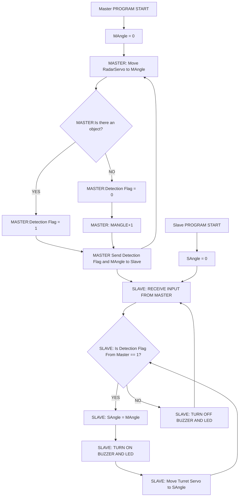

# AIGIS - Arduino Guided Interception and Engagement System

**Kelompok 10**
Anggota Kelompok:
- Andi Muhammad Alvin Farhansyah (2306161933)
- Falah Andhesryo (2306161990)
- Ganendra Garda Pratama (2306250642)	
- Rowen Rodotua Harahap (2306250604)	

## I. Introduction to the Problem and the Solution

Di era modern ini, kebutuhan akan sistem keamanan yang lebih cerdas dan responsif semakin meningkat. Sistem konvensional seperti kamera pengawas statis atau alarm pasif sering kali tidak cukup tanggap dalam mendeteksi dan merespons ancaman secara langsung. Akibatnya, banyak kejadian yang tak diinginkan terjadi hanya karena tidak adanya penanganan cepat oleh sistem yang digunakan.

Masalah ini membuka peluang untuk menghadirkan solusi keamanan yang tidak hanya mampu mendeteksi secara real-time, tetapi juga secara otomatis memberikan respons yang terlihat dan terdengar. Sistem semacam ini akan sangat berguna, terutama di lingkungan yang membutuhkan pengawasan mandiri tanpa intervensi manusia terus-menerus.

**AIGIS (Arduino Guided Interception and Engagement System)** dikembangkan sebagai jawaban atas tantangan tersebut. Sistem ini bekerja seperti radar mini yang memantau area secara menyapu, mendeteksi pergerakan objek menggunakan sensor inframerah, lalu mengarahkan turret ke posisi tersebut. Sebagai bentuk peringatan, LED dan buzzer akan aktif untuk menandakan adanya deteksi.

Dengan desain yang sederhana namun efektif, AIGIS menawarkan pendekatan baru dalam pengembangan sistem keamanan berbasis mikrokontroler. Proyek ini diharapkan dapat menjadi dasar untuk solusi yang lebih luas dan aplikatif dalam meningkatkan sistem keamanan otomatis di masa depan.

## II. Hardware Design and Implementation Details


Rangkaian sistem **AIGIS** yang ditampilkan di atas terdiri dari dua unit mikrokontroler **Arduino UNO** yang berperan sebagai **Master** dan **Slave**. Setiap bagian dari sistem memiliki peran spesifik, dan mereka saling terhubung untuk membentuk sistem keamanan otomatis yang dapat mendeteksi pergerakan, mengarahkan turret secara otomatis, dan memberikan peringatan visual serta audio.

### 1. Arduino UNO 
- **Master Arduino** bertugas menggerakkan radar servo untuk melakukan sweeping area dan membaca input dari sensor infrared (IR). Ketika objek terdeteksi, data dikirim ke Slave melalui protokol I2C.
- **Slave Arduino** menerima data dari Master dan meresponsnya dengan menggerakkan servo turret ke posisi yang sesuai, serta menyalakan LED dan buzzer sebagai sinyal peringatan.

Koneksi antar Arduino dilakukan menggunakan **jalur I2C**, yaitu melalui pin **SDA (A4)** dan **SCL (A5)** pada kedua papan Arduino.

### 2. Infrared Obstacle Sensor
Sensor IR digunakan untuk mendeteksi keberadaan objek berdasarkan pantulan sinyal inframerah. Pada rangkaian ini, pin **OUT sensor IR** dihubungkan ke **pin D2 (PD2) pada Arduino Master**. Sensor ini akan memberikan sinyal LOW saat mendeteksi objek, yang kemudian diproses oleh Master sebagai trigger deteksi.

### 3. LCD Display (I2C)
LCD digunakan sebagai tampilan informasi status sistem, misalnya saat radar mulai menyapu area atau saat mendeteksi objek. LCD ini menggunakan **interface I2C**, sehingga terhubung ke jalur yang sama dengan komunikasi Master–Slave: **SDA (A4)** dan **SCL (A5)**.

### 4. Servo Motor
Rangkaian ini menunjukkan dua buah servo motor:
- Servo pertama dihubungkan ke **pin D10 (PB2) pada Master**, berfungsi sebagai radar servo yang menyapu area dari sudut 0° hingga 180°.
- Servo kedua terhubung ke **pin D9 (PB1) pada Slave**, dan akan diarahkan ke sudut deteksi berdasarkan data yang diterima dari Master.

Servo dikendalikan menggunakan sinyal PWM, memungkinkan pengaturan sudut dengan tingkat presisi tinggi.

### 5. LED dan Buzzer
- **LED Merah (D1)** berfungsi sebagai indikator visual yang menyala saat deteksi objek terjadi. LED ini dihubungkan ke pin Slave melalui **resistor 330 ohm (R1)** untuk membatasi arus dan menjaga komponen tetap aman.
- **Buzzer (BUZ1)** berfungsi sebagai peringatan audio, diaktifkan oleh Slave untuk memberi tanda secara akustik bahwa sistem telah mendeteksi keberadaan objek.

Kedua indikator ini dikontrol sepenuhnya oleh Arduino Slave berdasarkan perintah dari Master.

### 6. Power dan Ground
Seluruh sistem mendapatkan catu daya dari jalur **5V dan GND**, dengan semua komponen berbagi ground yang sama agar sistem tetap stabil dan mencegah gangguan sinyal, khususnya untuk komunikasi I2C dan sinyal PWM.

---

Dengan konfigurasi perangkat keras seperti pada rangkaian ini, sistem **AIGIS** mampu bekerja secara terintegrasi untuk:
- Mendeteksi pergerakan di area pengawasan menggunakan sensor IR.
- Menyapu area dengan radar servo yang bergerak otomatis.
- Mengarahkan turret secara otomatis ke arah objek.
- Memberikan peringatan visual dan audio sebagai respons.

## III. Software Implementation Details

### General Overview

Software dari sistem AIGIS terdiri atas dua bagian, master dan slave.

Master berfungsi mengontrol servo radar untuk melakukan sweeping, menerima input dari sensor temperatur, serta mengirimkan sinyal ke LCD melalui UART.

Master akan selalu mengirimkan sinyal I2C ke slave berisi sudut dan detection flag. Apabila terdapat object, maka detection flag nya 1, jika tidak maka 0.  

```avrasm

;===========================
; TURRET MASTER - AVR ASM
;===========================
    #define __SFR_OFFSET 0x00
    #include <avr/io.h>

    .global radar_main
    .global currentAngle
    .global radarStopped

    .section .bss
    radarStopped:
    .byte 1
    currentAngle:
    .byte 1

    .section .text
    radar_main:
        ; === Init UART ===
        clr r16
        sts UCSR0A, r16
        sts UBRR0H, r16
        ldi r16, 103              ; Baud 9600 @ 16MHz
        sts UBRR0L, r16
        ldi r16, (1<<TXEN0)
        sts UCSR0B, r16
        ldi r16, (1<<UCSZ01)|(1<<UCSZ00)
        sts UCSR0C, r16

        ; === Init Servo PB2 (Digital Pin 10) ===
        ldi r16, (1<<DDB2)        ; Explicitly set pin 10 as output
        out DDRB, r16

        ; === Init IR Sensor PD2 (Digital Pin 2) ===
        cbi DDRD, 2               ; Set PD2 as input
        sbi PORTD, 2              ; Enable pull-up resistor
        
        ; === Timer0 CTC Setup ===
        ldi r16, (1<<WGM01)       ; CTC mode
        out TCCR0A, r16
        clr r16
        out TCCR0B, r16

        ; === Initialize radarStopped to 0 ===
        clr r16
        sts radarStopped, r16
        
        ; === Center servo to confirm it's working ===
        ldi r24, 90              ; Center position
        sts currentAngle, r24
        ldi r20, 20              ; Send 20 pulses for initial positioning
    center_loop:
        sbi PORTB, 2             ; HIGH on PB2
        rcall pwm_delay
        cbi PORTB, 2             ; LOW on PB2
        rcall delay_20ms
        dec r20
        brne center_loop
        
        ; === Print startup message ===
        ldi ZL, lo8(msg_start)
        ldi ZH, hi8(msg_start)
        rcall print_uart

        ; --- Init I2C Master ---
        rcall I2C_init

    main_loop:
        rjmp sweep_up

    sweep_up:
        ldi r24, 0             ; Start at 0°
    up_loop:
        in r21, PIND           ; Read IR sensor
        sbrs r21, 2            ; If PD2==0 (object), branch to detect
            rjmp detect_up
        ; Normal sweep motion when no object
        sts currentAngle, r24  ; store for ISR
        rcall rotate_servo     ; move servo
        inc r24                ; next angle
        cpi r24, 180
        brlo up_loop           ; continue until <180
        rjmp sweep_down        ; reverse direction after reaching 180

    detect_up:
        rcall object_detect    ; handle object detection
        rjmp up_loop           ; continue sweep after handling

    sweep_down:
        ldi r24, 180           ; Start at 180°
    down_loop:
        in r21, PIND
        sbrs r21, 2            ; If PD2==0 (object), branch to detect
            rjmp detect_down
        ; Normal sweep motion when no object
        sts currentAngle, r24
        rcall rotate_servo
        dec r24                ; previous angle
        brne down_loop         ; continue until >0
        rjmp sweep_up          ; reverse direction after reaching 0

    detect_down:
        rcall object_detect
        rjmp down_loop

    ; ---------------------------------------
    ; PWM Pulse Width: r24 (OCR0A units)
    pwm_delay:
        push r21              ; Save r21
        clr r21
        out TCNT0, r21
        out OCR0A, r21        ; clear match
        out OCR0A, r24
        ldi r21, 0b00001100   ; prescaler 64
        out TCCR0B, r21
    wait_pwm:
        in r21, TIFR0
        sbrs r21, OCF0A
        rjmp wait_pwm
        clr r21
        out TCCR0B, r21
        ldi r21, (1<<OCF0A)
        out TIFR0, r21
        pop r21               ; Restore r21
        ret

    ; ---------------------------------------
    ; Rotate servo at position in r24
    rotate_servo:
        ldi r20, 10         ; number of pulses for smooth motion
    rotate_loop:
        sbi PORTB, 2       ; drive PB2 high
        rcall pwm_delay    ; generate pulse width based on r24
        cbi PORTB, 2       ; drive PB2 low
        rcall delay_20ms   ; pause between pulses
        dec r20
        brne rotate_loop
        ret

    ; ---------------------------------------
    ; Delay for (20ms - r24 pulse duration)
    delay_rest_20ms:
        push r26
        push r27
        ldi r26, lo8(500)
        ldi r27, hi8(500)
        clr r1                ; Ensure carry subtraction base is zero
        sub r26, r24          ; Subtract low byte
        sbc r27, r1           ; Subtract high byte with carry

        ; Multiply (500 - r24) × 4
        lsl r26
        rol r27
        lsl r26
        rol r27

    delay_loop:
        sbiw r26, 1
        brne delay_loop
        pop r27
        pop r26
        ret

    ; ---------------------------------------
    ; Delay for ~20ms
    delay_20ms:
        push r26
        push r27
        ldi r26, lo8(1000)
        ldi r27, hi8(1000)
    delay_20ms_loop:
        sbiw r26, 1
        brne delay_20ms_loop
        pop r27
        pop r26
        ret

    ; ---------------------------------------
    ; Delay for ~50ms
    delay_50ms:
        push r26
        push r27
        ldi r26, lo8(30000)
        ldi r27, hi8(30000)
    delay_50ms_loop:
        sbiw r26, 1
        brne delay_50ms_loop
        pop r27
        pop r26
        ret

    ; ---------------------------------------
    ; UART Print from progmem Z
    print_uart:
        lpm r18, Z+
        cpi r18, 0
        breq done_uart
    wait_uart:
        lds r17, UCSR0A
        sbrs r17, UDRE0
        rjmp wait_uart
        sts UDR0, r18
        rjmp print_uart
    done_uart:
        ret

    ; ---------------------------------------
    ; Handle IR detection: send I2C flag, wait until sensor releases
    object_detect:
        rcall I2C_start
        ldi r27, 0b10010000    ; SLA+W (0x48<<1)
        rcall I2C_write
        ldi r27, 1             ; Object detected flag
        rcall I2C_write
        lds r27, currentAngle  ; Load last servo angle
        rcall I2C_write        ; Send servo angle
        rcall I2C_stop
    wait_no_obj:
        in r21, PIND
        sbrs r21, 2            ; Skip if PD2==1 (no object)
        rjmp wait_no_obj       ; Repeat while object present
        ret

    ; ---------------------------------------
    ; I2C Master Functions
    I2C_init:
        ; Set SCL frequency ~100kHz (16MHz/(16+2*TWBR))
        ldi r16, 72
        sts TWBR, r16
        ; Prescaler = 1
        ldi r16, 0
        sts TWSR, r16
        ; Enable TWI
        ldi r16, (1<<TWEN)
        sts TWCR, r16
        ret

    I2C_start:
        ; Send START
        ldi r16, (1<<TWINT)|(1<<TWSTA)|(1<<TWEN)
        sts TWCR, r16
    I2C_start_wait:
        lds r16, TWCR
        sbrs r16, TWINT
        rjmp I2C_start_wait
        ; Check for START transmitted (0x08)
        lds r16, TWSR
        andi r16, 0xF8
        cpi r16, 0x08
        brne I2C_start
        ret

    I2C_write:
        ; Write byte in r27
        sts TWDR, r27
        ldi r16, (1<<TWINT)|(1<<TWEN)
        sts TWCR, r16
    I2C_write_wait:
        lds r16, TWCR
        sbrs r16, TWINT
        rjmp I2C_write_wait
        ret

    I2C_stop:
        ; Send STOP
        ldi r16, (1<<TWINT)|(1<<TWSTO)|(1<<TWEN)
        sts TWCR, r16
        ret

    ; ---------------------------------------
    .section .progmem.data
    ; OCR0A values corresponding to these angles:
    ; 250 = ~0°, 480 = ~180°
    scan_pos:
        ; Sweep from left to right
        .word 250, 265, 280, 295, 310, 325  ; 0° to ~60°
        .word 340, 355, 370, 385, 400, 415  ; ~60° to ~120°
        .word 430, 445, 460, 480            ; ~120° to 180°
        ; Return from right to left
        .word 460, 445, 430, 415, 400, 385  ; 180° to ~120°
        .word 370, 355, 340, 325, 310, 295  ; ~120° to ~60°
        .word 280, 265, 250                 ; ~60° to 0°

    msg_scan:
        .ascii "Scanning...\n"
        .byte 0

    msg_start:
        .ascii "Radar system starting...\n"
        .byte 0

    msg_patrol:
        .ascii "Starting new patrol cycle...\n"
        .byte 0


```

File .ino (Untuk Menghandle interrupt)

```cpp
#include <Wire.h>
#include <Servo.h>

extern "C" void radar_main();             // Assembly logic
extern "C" volatile uint8_t radarStopped; // Shared with Assembly
extern "C" volatile uint8_t currentAngle; // Shared with Assembly

#define IR_PIN 2      // IR sensor on digital pin 2 (INT0)
#define SERVO_PIN 10  // Servo on digital pin 10 (PB2)
#define SLAVE_ADDR 0x48

Servo testServo;      // For direct control if needed
volatile unsigned long lastTriggerTime = 0;
volatile unsigned long resumeTime = 0;  // New: schedule resume time after detection

void setup() {
  Serial.begin(9600);
  delay(1000);  // Wait for serial to connect
  
  Serial.println(F("Radar system initializing..."));
  
  // Initialize I2C as master
  Wire.begin();
  
  // Direct port manipulation for IR sensor with pull-up
  DDRD &= ~(1 << DDD2);   // Clear the bit (input)
  PORTD |= (1 << PORTD2); // Set the bit (pullup)
  
  // Also set via Arduino API
  pinMode(IR_PIN, INPUT_PULLUP);
  
  // Test the IR sensor
  Serial.print(F("Initial IR state: "));
  Serial.println(digitalRead(IR_PIN) ? "HIGH (no object)" : "LOW (object detected)");
  
  // Also set up the servo pin just to be sure
  pinMode(SERVO_PIN, OUTPUT);
  
  // Test servo directly
  testServo.attach(SERVO_PIN);
  testServo.write(0);     // Full left
  delay(500);
  testServo.write(90);    // Center position
  delay(500);
  testServo.write(180);   // Full right
  delay(500);
  testServo.write(90);    // Back to center
  delay(500);
  testServo.detach();     // Let assembly take over
  
  // Make sure radarStopped is clear
  radarStopped = 0;
  
  // Enable external interrupt INT0 (Digital pin 2)
  // Using direct register manipulation for more reliable operation
  cli(); // Disable interrupts temporarily
  
  // Configure INT0 for falling edge (CHANGE mode didn't work reliably)
  EICRA |= (1 << ISC01);   // Falling edge of INT0 generates interrupt
  EICRA &= ~(1 << ISC00);
  EIMSK |= (1 << INT0);    // Enable INT0
  
  // Also use Arduino's API as backup
  attachInterrupt(digitalPinToInterrupt(IR_PIN), IR_ISR, FALLING);
  
  // Initialize control variables
  radarStopped = 0;
  currentAngle = 90;  // Start at middle position
  
  sei(); // Re-enable interrupts
  
  Serial.println(F("Starting radar main..."));
  radar_main();  // Starts the main servo logic from Assembly
}

void loop() {
  // Periodic checks to ensure everything is working
  static unsigned long lastBlink = 0;
  static unsigned long lastIRCheck = 0;
  
  // Heartbeat every 5 seconds
  if (millis() - lastBlink > 5000) {
    lastBlink = millis();
    
    // Check system status
    Serial.print(F("System alive, radarStopped="));
    Serial.print(radarStopped);
    Serial.print(F(", IR="));
    Serial.println(digitalRead(IR_PIN) ? "HIGH (no object)" : "LOW (object detected)");
    
    // If radarStopped is stuck, reset it
    if (radarStopped == 1 && digitalRead(IR_PIN) == HIGH) {
      Serial.println(F("⚠️ radarStopped stuck with no object! Resetting..."));
      radarStopped = 0;
    }
  }
  
  // Check IR sensor directly every second
  if (millis() - lastIRCheck > 1000) {
    lastIRCheck = millis();
    
    // Direct port reading for maximum reliability
    bool irDetected = ((PIND & (1 << PIND2)) == 0);
    
    if (irDetected) {
      Serial.println(F("IR LOW detected directly in loop"));
      
      // If radar isn't stopped but there's an object, trigger detection manually
      if (radarStopped == 0) {
        Serial.println(F("Forcing IR detection..."));
        IR_ISR();
      }
    }
  }

  // Auto-resume radar after scheduled delay
  if (radarStopped == 1 && resumeTime != 0 && millis() > resumeTime) {
    // Ensure sensor clear before resuming
    if ((PIND & (1 << PIND2)) != 0) {
      Serial.println(F("Resuming radar scan..."));
      radarStopped = 0;
      resumeTime = 0;
    }
  }
}

// Interrupt handler for INT0 (IR sensor)
// This gets called when an object is detected by the IR sensor
void IR_ISR() {
  // Disable further interrupts while handling this one
  cli();
  
  Serial.println(F("🚨 IR INTERRUPT TRIGGERED!"));
  
  // Get current time for debounce
  unsigned long now = millis();
  
  // Debounce: Ignore if triggered too soon after previous one
  if (now - lastTriggerTime < 300) {
    sei();
    return;
  }
  
  lastTriggerTime = now;
  
  // Double-check the pin state using direct port reading for reliability
  // Low means object detected
  if ((PIND & (1 << PIND2)) != 0) {
    Serial.println(F("False trigger - no object present"));
    sei();
    return;
  }
  
  Serial.println(F("IR TRIGGERED - Target Detected!"));
  Serial.print(F("Current angle: "));
  Serial.println(currentAngle);

  // Stop the radar
  radarStopped = 1;
  resumeTime = now + 3000;  // schedule resume after 3 seconds
  
  // Send current angle to turret via I2C
  Wire.beginTransmission(SLAVE_ADDR);
  Wire.write(currentAngle);
  byte result = Wire.endTransmission();
  
  if (result == 0) {
    Serial.print(F("Angle sent to turret: "));
    Serial.println(currentAngle);
  } else {
    Serial.print(F("I2C error: "));
    Serial.println(result);
  }

  sei();  // re-enable interrupts quickly
}
```


Sistem Slave bertugas menggerakkan servo turret, ke arah target dan menyalakan LED dan Buzzer. Setelah menerima sinyal I2C dari Master, apabila detection flag nya 1, sistem akan menggerakan servo turret ke arah sudut yang diberikan oleh master serta menyalakan LED dan buzzer.

```avrasm

;===========================
; TURRET SLAVE - AVR ASM
;===========================
#define __SFR_OFFSET 0x00
#include "avr/io.h"

.global slave_main

slave_main:
    ; --- Enable pull-ups on SDA (PC4) and SCL (PC5) ---
    cbi DDRC, 4
    sbi PORTC, 4
    cbi DDRC, 5
    sbi PORTC, 5
    ; --- Set PB1 (Digital Pin 9) as output for servo ---
    sbi DDRB, 1
    
    ; --- Setup Timer0 for precise servo pulse timing ---
    ldi r16, (1<<WGM01)    ; CTC mode
    out TCCR0A, r16
    clr r16
    out TCCR0B, r16        ; Timer stopped (will be configured during use)

    ; --- LED (PB5) on pin 13, Buzzer (PD0/PB0) on pin 8 ---
    sbi DDRB, 5            ; Configure LED pin as output (PB5, pin 13)
    sbi DDRB, 0            ; Configure buzzer pin as output (PB0, pin 8)
    cbi PORTB, 5           ; Turn off LED initially
    cbi PORTB, 0           ; Turn off buzzer initially

    ; --- Init I2C Slave 0x48 ---
    rcall I2C_slave_init

listen_loop:
    rcall I2C_listen
    rcall I2C_read
    mov r21, r27        ; save detection flag
    rcall I2C_read
    mov r20, r27        ; save angle
    cpi r21, 0          ; if flag==0, clear alert
    breq clear_alert

    ; Ensure angle is within valid limits (15-165)
    cpi r20, 15
    brlo clip_low
    cpi r20, 165
    brsh clip_high
    rjmp angle_ok

clip_low:
    ldi r20, 15
    rjmp angle_ok

clip_high:
    ldi r20, 165

angle_ok:
    mov r22, r20
    ; Use improved servo control method
    rcall send_servo_pulse
    
    ; Also update PWM registers for continuous operation
    rcall angle_to_pwm
    sts OCR1AL, r24
    sts OCR1AH, r25

    ; Alert sequence when target is detected
    ; Turn on LED
    sbi PORTB, 5     ; Turn on LED (PB5, pin 13)
    
    ; Buzzer alarm pattern (3 short beeps)
    ldi r23, 3       ; 3 beeps
buzzer_loop:
    sbi PORTB, 0     ; Turn on buzzer (PB0, pin 8)
    rcall delay_50ms ; Beep for 50ms
    cbi PORTB, 0     ; Turn off buzzer
    rcall delay_50ms ; Pause for 50ms
    dec r23
    brne buzzer_loop
    
    ; Auto-clear LED after alert
    cbi PORTB, 5     ; Turn off LED
    
    rjmp listen_loop

clear_alert:
    cbi PORTB, 5     ; Turn off LED (PB5, pin 13)
    cbi PORTB, 0     ; Ensure buzzer is off (PB0, pin 8)
    rjmp listen_loop

;===========================
; Improved Servo Control Functions
;===========================
; Rotate servo based on angle in r24
rotate_turret_servo:
    ldi r20, 10          ; Send 10 pulses for stability
loop_servo_pulse:
    sbi PORTB, 1         ; HIGH on PB1 (Digital Pin 9)
    rcall turret_delay_timer0   ; Delay based on angle (r24)
    cbi PORTB, 1         ; LOW on PB1
    rcall delay_20ms     ; Delay between pulses
    dec r20
    brne loop_servo_pulse
    ret

; Delay based on pulse width in r24
turret_delay_timer0:
    clr r21
    out TCNT0, r21
    mov r21, r24
    out OCR0A, r21
    ldi r21, 0b00001100     ; Timer0 CTC mode, prescaler 256
    out TCCR0B, r21

turret_wait_ctc:
    in r21, TIFR0
    sbrs r21, OCF0A
    rjmp turret_wait_ctc
    clr r21
    out TCCR0B, r21
    ldi r21, (1 << OCF0A)
    out TIFR0, r21
    ret

;===========================
; I2C Slave Functions
;===========================

; Initialize I2C slave with address 0x48
I2C_slave_init:
    ; Set slave address to 0x48 with general call recognition enabled
    ldi r16, 0x48 << 1 | 1
    sts TWAR, r16
    ; Set prescaler to 1
    ldi r16, 0
    sts TWSR, r16
    ; Enable TWI and acknowledge
    ldi r16, (1<<TWEN)|(1<<TWEA)|(1<<TWINT)
    sts TWCR, r16
    ret

; Listen for I2C transactions addressed to this device
I2C_listen:
    ; Enable acknowledge and clear interrupt flag to start listening
    ldi r16, (1<<TWEN)|(1<<TWEA)|(1<<TWINT)
    sts TWCR, r16
I2C_listen_wait:
    ; Wait for TWI interrupt flag
    lds r16, TWCR
    sbrs r16, TWINT
    rjmp I2C_listen_wait
    
    ; Check if it's an address match
    lds r16, TWSR
    andi r16, 0xF8
    cpi r16, 0x60    ; SLA+W received, ACK sent
    breq I2C_listen_addr_match
    cpi r16, 0x70    ; General call address received, ACK sent
    breq I2C_listen_addr_match
    
    ; If not an address match, continue listening
    rjmp I2C_listen
    
I2C_listen_addr_match:
    ret

; Read a byte from I2C master (stores in r27)
I2C_read:
    ; Clear interrupt flag to receive data
    ldi r16, (1<<TWEN)|(1<<TWINT)|(1<<TWEA)
    sts TWCR, r16
    sts TWCR, r16
I2C_read_wait:
    ; Wait for data
    lds r16, TWCR
    sbrs r16, TWINT
    rjmp I2C_read_wait
    
    ; Check status and get received byte
    lds r16, TWSR
    andi r16, 0xF8
    cpi r16, 0x80    ; Data received, ACK sent
    breq I2C_read_ok
    cpi r16, 0x90    ; Data received after general call, ACK sent
    breq I2C_read_ok
    cpi r16, 0xA0    ; STOP or REPEATED START received
    breq I2C_read_stop
    
    ; Handle unexpected status - restart listening
    ldi r27, 0       ; Return 0 on error
    rjmp I2C_read_done
    
I2C_read_ok:
    lds r27, TWDR    ; Load received byte into r27
    rjmp I2C_read_done
    
I2C_read_stop:
    ldi r27, 0       ; Return 0 on STOP condition
    
I2C_read_done:
    ; If STOP received, reset to listen mode
    cpi r16, 0xA0
    brne I2C_read_exit
    
    ; Re-enable listening after receiving STOP
    ldi r16, (1<<TWEN)|(1<<TWEA)|(1<<TWINT)
    sts TWCR, r16
    
I2C_read_exit:
    ret

;===========================
; Improved Servo Control Functions
;===========================

; Send multiple servo pulses for better reliability
send_servo_pulse:
    ; Save the angle in r24
    mov r24, r22
    
    ; Send multiple pulses for better response
    ldi r20, 5       ; Number of pulses
servo_pulse_loop:
    rcall send_single_pulse
    rcall delay_20ms
    dec r20
    brne servo_pulse_loop
    ret

; Send a single pulse with timing based on r24
send_single_pulse:
    ; Configure Timer0 for precise pulse timing
    clr r21
    out TCNT0, r21
    mov r21, r24
    out OCR0A, r21
    
    ; Start the pulse
    sbi PORTB, 1     ; HIGH on PB1
    
    ; Configure timer - CTC mode, prescaler 256
    ldi r21, 0b00001100
    out TCCR0B, r21
    
wait_for_pulse_end:
    in r21, TIFR0
    sbrs r21, OCF0A
    rjmp wait_for_pulse_end
    
    ; End the pulse and clean up
    cbi PORTB, 1     ; LOW on PB1
    clr r21
    out TCCR0B, r21
    ldi r21, (1 << OCF0A)
    out TIFR0, r21
    ret

; Delay of 20ms for servo timing
delay_20ms:
    ldi r21, 200
d20_1: ldi r22, 200
d20_2: ldi r23, 2
d20_3: dec r23
    brne d20_3
    dec r22
    brne d20_2
    dec r21
    brne d20_1
    ret

;===========================
; Angle to PWM Conversion
;===========================
; Converts angle in r22 to PWM value in r24:r25
angle_to_pwm:
    ; Assuming a linear mapping:
    ; Angle 15 -> PWM 1000 (1ms pulse)
    ; Angle 165 -> PWM 2000 (2ms pulse)
    ; PWM = 1000 + ((angle - 15) * (2000 - 1000) / (165 - 15))
    
    ldi r23, 1000 / 256    ; Base PWM high byte
    ldi r24, 1000 % 256    ; Base PWM low byte
    mov r25, r22           ; Copy angle to r25
    subi r25, 15           ; Subtract minimum angle (15)
    ldi r26, 6             ; Scale factor ((2000 - 1000) / (165 - 15) = 6)
    mul r25, r26           ; Multiply (angle - 15) by scale factor
    add r24, r0            ; Add low byte of result to PWM low byte
    adc r23, r1            ; Add high byte of result to PWM high byte
    clr r1                 ; Clear r1 after multiplication
    ret

;===========================
; Delay Functions
;===========================

; Approximately 50ms delay at 16MHz
delay_50ms:
    ldi r18, 250
delay_outer:
    ldi r17, 250
delay_inner:
    nop
    nop
    dec r17
    brne delay_inner
    dec r18
    brne delay_outer
    ret

```

Kode .ino (Untuk menghandle interrupt)

```cpp
// Declare the external assembly function
extern "C" void slave_main();

void setup() {
  // Initialize serial for debugging
  Serial.begin(9600);
  Serial.println("Turret Slave starting...");
  
  // Set up pins for I2C (A4=SDA, A5=SCL on most Arduinos)
  // This is just for explicit hardware initialization
  pinMode(A4, INPUT_PULLUP);  // SDA
  pinMode(A5, INPUT_PULLUP);  // SCL
  
  // Set up pins used in assembly code
  pinMode(9, OUTPUT);  // OC1A (PB1) for servo
  pinMode(13, OUTPUT); // LED (PB5)
  pinMode(8, OUTPUT);  // Buzzer (PB0, digital pin 8)
  
  delay(1000); // Give time for devices to stabilize
  Serial.println("Calling assembly slave_main...");
  
  // Call the assembly main function
  slave_main();
}

void loop() {
  // Nothing to do here, assembly code has its own loop
}
```

Algoritma hubungan sistem master dan slave bisa dilihat dalam flowchart berikut.




### The Master System

Sistem Master bertujuan untuk mendeteksi object melalui radar sweeping serta mengolah output dari sensor menjadi LCD Display dan sinyal ke slave.

``` avrasm

``avrasm

;===========================
; TURRET MASTER - AVR ASM
;===========================
    #define __SFR_OFFSET 0x00
    #include <avr/io.h>

    .global radar_main
    .global currentAngle
    .global radarStopped

    .section .bss
    radarStopped:
    .byte 1
    currentAngle:
    .byte 1

    .section .text
    radar_main:
        ; === Init UART ===
        clr r16
        sts UCSR0A, r16
        sts UBRR0H, r16
        ldi r16, 103              ; Baud 9600 @ 16MHz
        sts UBRR0L, r16
        ldi r16, (1<<TXEN0)
        sts UCSR0B, r16
        ldi r16, (1<<UCSZ01)|(1<<UCSZ00)
        sts UCSR0C, r16

        ; === Init Servo PB2 (Digital Pin 10) ===
        ldi r16, (1<<DDB2)        ; Explicitly set pin 10 as output
        out DDRB, r16

        ; === Init IR Sensor PD2 (Digital Pin 2) ===
        cbi DDRD, 2               ; Set PD2 as input
        sbi PORTD, 2              ; Enable pull-up resistor
        
        ; === Timer0 CTC Setup ===
        ldi r16, (1<<WGM01)       ; CTC mode
        out TCCR0A, r16
        clr r16
        out TCCR0B, r16

        ; === Initialize radarStopped to 0 ===
        clr r16
        sts radarStopped, r16
        
        ; === Center servo to confirm it's working ===
        ldi r24, 90              ; Center position
        sts currentAngle, r24
        ldi r20, 20              ; Send 20 pulses for initial positioning
    center_loop:
        sbi PORTB, 2             ; HIGH on PB2
        rcall pwm_delay
        cbi PORTB, 2             ; LOW on PB2
        rcall delay_20ms
        dec r20
        brne center_loop
        
        ; === Print startup message ===
        ldi ZL, lo8(msg_start)
        ldi ZH, hi8(msg_start)
        rcall print_uart

        ; --- Init I2C Master ---
        rcall I2C_init

    main_loop:
        rjmp sweep_up

    sweep_up:
        ldi r24, 0             ; Start at 0°
    up_loop:
        in r21, PIND           ; Read IR sensor
        sbrs r21, 2            ; If PD2==0 (object), branch to detect
            rjmp detect_up
        ; Normal sweep motion when no object
        sts currentAngle, r24  ; store for ISR
        rcall rotate_servo     ; move servo
        inc r24                ; next angle
        cpi r24, 180
        brlo up_loop           ; continue until <180
        rjmp sweep_down        ; reverse direction after reaching 180

    detect_up:
        rcall object_detect    ; handle object detection
        rjmp up_loop           ; continue sweep after handling

    sweep_down:
        ldi r24, 180           ; Start at 180°
    down_loop:
        in r21, PIND
        sbrs r21, 2            ; If PD2==0 (object), branch to detect
            rjmp detect_down
        ; Normal sweep motion when no object
        sts currentAngle, r24
        rcall rotate_servo
        dec r24                ; previous angle
        brne down_loop         ; continue until >0
        rjmp sweep_up          ; reverse direction after reaching 0

    detect_down:
        rcall object_detect
        rjmp down_loop

    ; ---------------------------------------
    ; PWM Pulse Width: r24 (OCR0A units)
    pwm_delay:
        push r21              ; Save r21
        clr r21
        out TCNT0, r21
        out OCR0A, r21        ; clear match
        out OCR0A, r24
        ldi r21, 0b00001100   ; prescaler 64
        out TCCR0B, r21
    wait_pwm:
        in r21, TIFR0
        sbrs r21, OCF0A
        rjmp wait_pwm
        clr r21
        out TCCR0B, r21
        ldi r21, (1<<OCF0A)
        out TIFR0, r21
        pop r21               ; Restore r21
        ret

    ; ---------------------------------------
    ; Rotate servo at position in r24
    rotate_servo:
        ldi r20, 10         ; number of pulses for smooth motion
    rotate_loop:
        sbi PORTB, 2       ; drive PB2 high
        rcall pwm_delay    ; generate pulse width based on r24
        cbi PORTB, 2       ; drive PB2 low
        rcall delay_20ms   ; pause between pulses
        dec r20
        brne rotate_loop
        ret

    ; ---------------------------------------
    ; Delay for (20ms - r24 pulse duration)
    delay_rest_20ms:
        push r26
        push r27
        ldi r26, lo8(500)
        ldi r27, hi8(500)
        clr r1                ; Ensure carry subtraction base is zero
        sub r26, r24          ; Subtract low byte
        sbc r27, r1           ; Subtract high byte with carry

        ; Multiply (500 - r24) × 4
        lsl r26
        rol r27
        lsl r26
        rol r27

    delay_loop:
        sbiw r26, 1
        brne delay_loop
        pop r27
        pop r26
        ret

    ; ---------------------------------------
    ; Delay for ~20ms
    delay_20ms:
        push r26
        push r27
        ldi r26, lo8(1000)
        ldi r27, hi8(1000)
    delay_20ms_loop:
        sbiw r26, 1
        brne delay_20ms_loop
        pop r27
        pop r26
        ret

    ; ---------------------------------------
    ; Delay for ~50ms
    delay_50ms:
        push r26
        push r27
        ldi r26, lo8(30000)
        ldi r27, hi8(30000)
    delay_50ms_loop:
        sbiw r26, 1
        brne delay_50ms_loop
        pop r27
        pop r26
        ret

    ; ---------------------------------------
    ; UART Print from progmem Z
    print_uart:
        lpm r18, Z+
        cpi r18, 0
        breq done_uart
    wait_uart:
        lds r17, UCSR0A
        sbrs r17, UDRE0
        rjmp wait_uart
        sts UDR0, r18
        rjmp print_uart
    done_uart:
        ret

    ; ---------------------------------------
    ; Handle IR detection: send I2C flag, wait until sensor releases
    object_detect:
        rcall I2C_start
        ldi r27, 0b10010000    ; SLA+W (0x48<<1)
        rcall I2C_write
        ldi r27, 1             ; Object detected flag
        rcall I2C_write
        lds r27, currentAngle  ; Load last servo angle
        rcall I2C_write        ; Send servo angle
        rcall I2C_stop
    wait_no_obj:
        in r21, PIND
        sbrs r21, 2            ; Skip if PD2==1 (no object)
        rjmp wait_no_obj       ; Repeat while object present
        ret

    ; ---------------------------------------
    ; I2C Master Functions
    I2C_init:
        ; Set SCL frequency ~100kHz (16MHz/(16+2*TWBR))
        ldi r16, 72
        sts TWBR, r16
        ; Prescaler = 1
        ldi r16, 0
        sts TWSR, r16
        ; Enable TWI
        ldi r16, (1<<TWEN)
        sts TWCR, r16
        ret

    I2C_start:
        ; Send START
        ldi r16, (1<<TWINT)|(1<<TWSTA)|(1<<TWEN)
        sts TWCR, r16
    I2C_start_wait:
        lds r16, TWCR
        sbrs r16, TWINT
        rjmp I2C_start_wait
        ; Check for START transmitted (0x08)
        lds r16, TWSR
        andi r16, 0xF8
        cpi r16, 0x08
        brne I2C_start
        ret

    I2C_write:
        ; Write byte in r27
        sts TWDR, r27
        ldi r16, (1<<TWINT)|(1<<TWEN)
        sts TWCR, r16
    I2C_write_wait:
        lds r16, TWCR
        sbrs r16, TWINT
        rjmp I2C_write_wait
        ret

    I2C_stop:
        ; Send STOP
        ldi r16, (1<<TWINT)|(1<<TWSTO)|(1<<TWEN)
        sts TWCR, r16
        ret

    ; ---------------------------------------
    .section .progmem.data
    ; OCR0A values corresponding to these angles:
    ; 250 = ~0°, 480 = ~180°
    scan_pos:
        ; Sweep from left to right
        .word 250, 265, 280, 295, 310, 325  ; 0° to ~60°
        .word 340, 355, 370, 385, 400, 415  ; ~60° to ~120°
        .word 430, 445, 460, 480            ; ~120° to 180°
        ; Return from right to left
        .word 460, 445, 430, 415, 400, 385  ; 180° to ~120°
        .word 370, 355, 340, 325, 310, 295  ; ~120° to ~60°
        .word 280, 265, 250                 ; ~60° to 0°

    msg_scan:
        .ascii "Scanning...\n"
        .byte 0

    msg_start:
        .ascii "Radar system starting...\n"
        .byte 0

    msg_patrol:
        .ascii "Starting new patrol cycle...\n"
        .byte 0


```

Sistem ini terdiri atas beberapa bagian:

- Initialization
- Main Loop

#### Initialization

Initialization adalah mode yang pertama kali dimasuki saat menyala. Mode ini bertujuan menset global variables yang dibutuhkan untuk operasi seperti lokasi register untuk sudut, UART, dan komunikasi I2C.

```avrasm
    .section .bss
    radarStopped:
    .byte 1
    currentAngle:
    .byte 1
```

bagian ini berisi uninitialized global variables; 
- radarStopped: flag yang menandakan bahwa scanning radar harus berhenti.
- currentAngle: yang menyimpan nilai sudut

```avrasm
    ; === Init UART ===
    clr r16
    sts UCSR0A, r16
    sts UBRR0H, r16
    ldi r16, 103              ; Baud 9600 @ 16MHz
    sts UBRR0L, r16
    ldi r16, (1<<TXEN0)
    sts UCSR0B, r16
    ldi r16, (1<<UCSZ01)|(1<<UCSZ00)
    sts UCSR0C, r16
```
Bagian ini berisi pengaturan awal UART untuk mengirikan sinyal ke LCD. 

```avrasm
    ; === Init Servo PB2 (Digital Pin 10) ===
    ldi r16, (1<<DDB2)        ; Set PB2 as output
    out DDRB, r16
```
Bagian ini mengonfigurasi pin servo di PB2 sebagai output dengan pull up resistor, dan menyimpan nilainya di register r16.

```avrasm
    ; === Init IR Sensor PD2 (Digital Pin 2) ===
    cbi DDRD, 2               ; Set PD2 as input
    sbi PORTD, 2              ; Enable pull-up resistor
```

Bagian ini bertujuan men-set pin D2 sebagai input dengan pull-up resistor.

```avrasm
    ; === Timer0 CTC Setup ===
    ldi r16, (1<<WGM01)       ; CTC mode
    out TCCR0A, r16
    clr r16
    out TCCR0B, r16
```

Bagan ini mennyiapkan timer0 sebagai referensi untuk delay pengiriman sinyal PWM.

```avrasm
    ; === Initialize radarStopped to 0 ===
    clr r16
    sts radarStopped, r16
```

Kode ini memberikan nilai radarStopped menjadi 0 dengan instruksi clr di r16 lalu menaruhnya di radarStopped.

```avrasm
    ; === Center servo to confirm it's working ===
    ldi r24, 90              ; Center position
    sts currentAngle, r24
    ldi r20, 20              ; Send 20 pulses for initial positioning
center_loop:
    sbi PORTB, 2             ; HIGH on PB2
    rcall pwm_delay
    cbi PORTB, 2             ; LOW on PB2
    rcall delay_20ms
    dec r20
    brne center_loop
```

Kode ini akan menggerakkan servo ke posisi 90 derajat atau tengah sebagai posisi awal.

```avrasm
    ; === Print startup message ===
    ldi ZL, lo8(msg_start)
    ldi ZH, hi8(msg_start)
    rcall print_uart
```

Bagian yang ini mengirimkan sinyal UART ke LCD yang berisi "Radar system starting..."

#### Main Loop 

Program Main Loop terdiri atas beberapa bagian:
- Sweep Up
- Sweep Down
- Object Detection
- UART Printing
- I2C Master

```avrasm
main_loop:
    rjmp sweep_up
```
Loop dimulai dengan melakukan sweep up

```avrasm
sweep_up:
    ldi r24, 0
up_loop:
    in r21, PIND
    sbrs r21, 2
        rjmp detect_up
    sts currentAngle, r24
    rcall rotate_servo
    inc r24
    cpi r24, 180
    brlo up_loop
    rjmp sweep_down
```

Bagian ini berfungsi menggerakkan servo dari 0 derajat ke 180 derajat. Jika mendeteksi object akan jump ke detect_up. Jika sudah di 180 derajat akan jump ke sweep down.

```avrasm
sweep_down:
    ldi r24, 180
down_loop:
    in r21, PIND
    sbrs r21, 2
        rjmp detect_down
    sts currentAngle, r24
    rcall rotate_servo
    dec r24
    brne down_loop
    rjmp sweep_up
```

Logicnya sama seperti Sweep Up namun arahnya terbalik dari 180 derajat ke 0 derajat. Apabila di 0 derajat maka aka jump ke sweep up. Jika mendeteksi object akan jump ke detect_down.

```avrasm
object_detect:
    rcall I2C_start
    ldi r27, 0b10010000    ; SLA+W (0x48<<1)
    rcall I2C_write
    ldi r27, 1             ; Object detected flag
    rcall I2C_write
    lds r27, currentAngle
    rcall I2C_write
    rcall I2C_stop
wait_no_obj:
    in r21, PIND
    sbrs r21, 2
    rjmp wait_no_obj
    ret
```

Kode ini adalah object detection handler dan akan dijalankan setelah melakukan interrupt yang disebabkan saat mendeteksi object.

Ketika object dideteksi, maka transmisi I2C akan dimulai, mengirim detection flag '1' ke slave dan baru akan mengirim '0' ketika object sudah tidak terdeteksi.

```avrasm
pwm_delay:
    push r21
    clr r21
    out TCNT0, r21
    out OCR0A, r24
    ldi r21, 0b00001100   ; prescaler 64
    out TCCR0B, r21
wait_pwm:
    in r21, TIFR0
    sbrs r21, OCF0A
    rjmp wait_pwm
    clr r21
    out TCCR0B, r21
    ldi r21, (1<<OCF0A)
    out TIFR0, r21
    pop r21
    ret
```

Akan memberikan delay sesuai nilai di r24, register yang menyimpan sudut sehingga arah servo bisa diatur.

```avrasm
rotate_servo:
    ldi r20, 10         ; number of pulses for smooth motion
rotate_loop:
    sbi PORTB, 2       ; drive PB2 high
    rcall pwm_delay
    cbi PORTB, 2       ; drive PB2 low
    rcall delay_20ms
    dec r20
    brne rotate_loop
    ret
```

Digunakan untuk mengirimkan repeated pulses ke sudut target menggunakan pwm.

### UART Printing

```avrasm
print_uart:
    lpm r18, Z+
    cpi r18, 0
    breq done_uart
wait_uart:
    lds r17, UCSR0A
    sbrs r17, UDRE0
    rjmp wait_uart
    sts UDR0, r18
    rjmp print_uart
done_uart:
    ret
```

Kode ini digunakan untuk mengirim null terminated strings dari flash memory.

#### I2C Functions

```avrasm
I2C_init:
    ldi r16, 72
    sts TWBR, r16
    ldi r16, 0
    sts TWSR, r16
    ldi r16, (1<<TWEN)
    sts TWCR, r16
    ret
```

Untuk memulai I2C dengan mengirim sinyal START.

```avrasm
I2C_write:
    sts TWDR, r27
    ldi r16, (1<<TWINT)|(1<<TWEN)
    sts TWCR, r16
```

Digunakan untuk mengirim isi r27, current angle, melalui I2C

```avrasm
I2C_stop:
    ldi r16, (1<<TWINT)|(1<<TWSTO)|(1<<TWEN)
    sts TWCR, r16
    ret
```

Digunakan untuk menghentikan transmisi I2C

#### Isi Flash Memory

```avrasm
.section .progmem.data
msg_scan:
    .ascii "Scanning...\n"
    .byte 0

msg_start:
    .ascii "Radar system starting...\n"
    .byte 0

msg_patrol:
    .ascii "Starting new patrol cycle...\n"
    .byte 0
```

isi dari flash memory yang berisi string-string di LCD.

### Isi .ino file untuk handling interrupt

```cpp
#include <Wire.h>
#include <Servo.h>

extern "C" void radar_main();             // Assembly logic
extern "C" volatile uint8_t radarStopped; // Shared with Assembly
extern "C" volatile uint8_t currentAngle; // Shared with Assembly

#define IR_PIN 2      // IR sensor on digital pin 2 (INT0)
#define SERVO_PIN 10  // Servo on digital pin 10 (PB2)
#define SLAVE_ADDR 0x48

Servo testServo;      // For direct control if needed
volatile unsigned long lastTriggerTime = 0;
volatile unsigned long resumeTime = 0;  // New: schedule resume time after detection

void setup() {
  Serial.begin(9600);
  delay(1000);  // Wait for serial to connect
  
  Serial.println(F("Radar system initializing..."));
  
  // Initialize I2C as master
  Wire.begin();
  
  // Direct port manipulation for IR sensor with pull-up
  DDRD &= ~(1 << DDD2);   // Clear the bit (input)
  PORTD |= (1 << PORTD2); // Set the bit (pullup)
  
  // Also set via Arduino API
  pinMode(IR_PIN, INPUT_PULLUP);
  
  // Test the IR sensor
  Serial.print(F("Initial IR state: "));
  Serial.println(digitalRead(IR_PIN) ? "HIGH (no object)" : "LOW (object detected)");
  
  // Also set up the servo pin just to be sure
  pinMode(SERVO_PIN, OUTPUT);
  
  // Test servo directly
  testServo.attach(SERVO_PIN);
  testServo.write(0);     // Full left
  delay(500);
  testServo.write(90);    // Center position
  delay(500);
  testServo.write(180);   // Full right
  delay(500);
  testServo.write(90);    // Back to center
  delay(500);
  testServo.detach();     // Let assembly take over
  
  // Make sure radarStopped is clear
  radarStopped = 0;
  
  // Enable external interrupt INT0 (Digital pin 2)
  // Using direct register manipulation for more reliable operation
  cli(); // Disable interrupts temporarily
  
  // Configure INT0 for falling edge (CHANGE mode didn't work reliably)
  EICRA |= (1 << ISC01);   // Falling edge of INT0 generates interrupt
  EICRA &= ~(1 << ISC00);
  EIMSK |= (1 << INT0);    // Enable INT0
  
  // Also use Arduino's API as backup
  attachInterrupt(digitalPinToInterrupt(IR_PIN), IR_ISR, FALLING);
  
  // Initialize control variables
  radarStopped = 0;
  currentAngle = 90;  // Start at middle position
  
  sei(); // Re-enable interrupts
  
  Serial.println(F("Starting radar main..."));
  radar_main();  // Starts the main servo logic from Assembly
}

void loop() {
  // Periodic checks to ensure everything is working
  static unsigned long lastBlink = 0;
  static unsigned long lastIRCheck = 0;
  
  // Heartbeat every 5 seconds
  if (millis() - lastBlink > 5000) {
    lastBlink = millis();
    
    // Check system status
    Serial.print(F("System alive, radarStopped="));
    Serial.print(radarStopped);
    Serial.print(F(", IR="));
    Serial.println(digitalRead(IR_PIN) ? "HIGH (no object)" : "LOW (object detected)");
    
    // If radarStopped is stuck, reset it
    if (radarStopped == 1 && digitalRead(IR_PIN) == HIGH) {
      Serial.println(F("⚠️ radarStopped stuck with no object! Resetting..."));
      radarStopped = 0;
    }
  }
  
  // Check IR sensor directly every second
  if (millis() - lastIRCheck > 1000) {
    lastIRCheck = millis();
    
    // Direct port reading for maximum reliability
    bool irDetected = ((PIND & (1 << PIND2)) == 0);
    
    if (irDetected) {
      Serial.println(F("IR LOW detected directly in loop"));
      
      // If radar isn't stopped but there's an object, trigger detection manually
      if (radarStopped == 0) {
        Serial.println(F("Forcing IR detection..."));
        IR_ISR();
      }
    }
  }

  // Auto-resume radar after scheduled delay
  if (radarStopped == 1 && resumeTime != 0 && millis() > resumeTime) {
    // Ensure sensor clear before resuming
    if ((PIND & (1 << PIND2)) != 0) {
      Serial.println(F("Resuming radar scan..."));
      radarStopped = 0;
      resumeTime = 0;
    }
  }
}

// Interrupt handler for INT0 (IR sensor)
// This gets called when an object is detected by the IR sensor
void IR_ISR() {
  // Disable further interrupts while handling this one
  cli();
  
  Serial.println(F("🚨 IR INTERRUPT TRIGGERED!"));
  
  // Get current time for debounce
  unsigned long now = millis();
  
  // Debounce: Ignore if triggered too soon after previous one
  if (now - lastTriggerTime < 300) {
    sei();
    return;
  }
  
  lastTriggerTime = now;
  
  // Double-check the pin state using direct port reading for reliability
  // Low means object detected
  if ((PIND & (1 << PIND2)) != 0) {
    Serial.println(F("False trigger - no object present"));
    sei();
    return;
  }
  
  Serial.println(F("IR TRIGGERED - Target Detected!"));
  Serial.print(F("Current angle: "));
  Serial.println(currentAngle);

  // Stop the radar
  radarStopped = 1;
  resumeTime = now + 3000;  // schedule resume after 3 seconds
  
  // Send current angle to turret via I2C
  Wire.beginTransmission(SLAVE_ADDR);
  Wire.write(currentAngle);
  byte result = Wire.endTransmission();
  
  if (result == 0) {
    Serial.print(F("Angle sent to turret: "));
    Serial.println(currentAngle);
  } else {
    Serial.print(F("I2C error: "));
    Serial.println(result);
  }

  sei();  // re-enable interrupts quickly
}
```

Kode .ino digunakan untuk menghandle interrupt.

Isi kode ini berguna menghandle object detection sehingga ketika objek dideteksi, interrupt dipanggil dan langsung melakukan kode di .ino daripada harus menunggu superloop.

### The Slave System

Slave System berfungsi menggerakkan servo turret setelah menerima sinyal I2C dari master. Sinyal tersebut berupa detection Flag yang akan bernilai '1' jika terdapat objek dan akan bernilai '0' jika objeknya sudah tidak ada, dan sudut arah objeknya. Kode tersebut terdiri atas kode assembly (.S) dan kode Cpp (.ino) untuk menghandle interrupt.

```avrasm
;===========================
; TURRET SLAVE - AVR ASM
;===========================
#define __SFR_OFFSET 0x00
#include "avr/io.h"

.global slave_main

slave_main:
    ; --- Enable pull-ups on SDA (PC4) and SCL (PC5) ---
    cbi DDRC, 4
    sbi PORTC, 4
    cbi DDRC, 5
    sbi PORTC, 5
    ; --- Set PB1 (Digital Pin 9) as output for servo ---
    sbi DDRB, 1
    
    ; --- Setup Timer0 for precise servo pulse timing ---
    ldi r16, (1<<WGM01)    ; CTC mode
    out TCCR0A, r16
    clr r16
    out TCCR0B, r16        ; Timer stopped (will be configured during use)

    ; --- LED (PB5) on pin 13, Buzzer (PD0/PB0) on pin 8 ---
    sbi DDRB, 5            ; Configure LED pin as output (PB5, pin 13)
    sbi DDRB, 0            ; Configure buzzer pin as output (PB0, pin 8)
    cbi PORTB, 5           ; Turn off LED initially
    cbi PORTB, 0           ; Turn off buzzer initially

    ; --- Init I2C Slave 0x48 ---
    rcall I2C_slave_init

listen_loop:
    rcall I2C_listen
    rcall I2C_read
    mov r21, r27        ; save detection flag
    rcall I2C_read
    mov r20, r27        ; save angle
    cpi r21, 0          ; if flag==0, clear alert
    breq clear_alert

    ; Ensure angle is within valid limits (15-165)
    cpi r20, 15
    brlo clip_low
    cpi r20, 165
    brsh clip_high
    rjmp angle_ok

clip_low:
    ldi r20, 15
    rjmp angle_ok

clip_high:
    ldi r20, 165

angle_ok:
    mov r22, r20
    ; Use improved servo control method
    rcall send_servo_pulse
    
    ; Also update PWM registers for continuous operation
    rcall angle_to_pwm
    sts OCR1AL, r24
    sts OCR1AH, r25

    ; Alert sequence when target is detected
    ; Turn on LED
    sbi PORTB, 5     ; Turn on LED (PB5, pin 13)
    
    ; Buzzer alarm pattern (3 short beeps)
    ldi r23, 3       ; 3 beeps
buzzer_loop:
    sbi PORTB, 0     ; Turn on buzzer (PB0, pin 8)
    rcall delay_50ms ; Beep for 50ms
    cbi PORTB, 0     ; Turn off buzzer
    rcall delay_50ms ; Pause for 50ms
    dec r23
    brne buzzer_loop
    
    ; Auto-clear LED after alert
    cbi PORTB, 5     ; Turn off LED
    
    rjmp listen_loop

clear_alert:
    cbi PORTB, 5     ; Turn off LED (PB5, pin 13)
    cbi PORTB, 0     ; Ensure buzzer is off (PB0, pin 8)
    rjmp listen_loop

;===========================
; Improved Servo Control Functions
;===========================
; Rotate servo based on angle in r24
rotate_turret_servo:
    ldi r20, 10          ; Send 10 pulses for stability
loop_servo_pulse:
    sbi PORTB, 1         ; HIGH on PB1 (Digital Pin 9)
    rcall turret_delay_timer0   ; Delay based on angle (r24)
    cbi PORTB, 1         ; LOW on PB1
    rcall delay_20ms     ; Delay between pulses
    dec r20
    brne loop_servo_pulse
    ret

; Delay based on pulse width in r24
turret_delay_timer0:
    clr r21
    out TCNT0, r21
    mov r21, r24
    out OCR0A, r21
    ldi r21, 0b00001100     ; Timer0 CTC mode, prescaler 256
    out TCCR0B, r21

turret_wait_ctc:
    in r21, TIFR0
    sbrs r21, OCF0A
    rjmp turret_wait_ctc
    clr r21
    out TCCR0B, r21
    ldi r21, (1 << OCF0A)
    out TIFR0, r21
    ret

;===========================
; I2C Slave Functions
;===========================

; Initialize I2C slave with address 0x48
I2C_slave_init:
    ; Set slave address to 0x48 with general call recognition enabled
    ldi r16, 0x48 << 1 | 1
    sts TWAR, r16
    ; Set prescaler to 1
    ldi r16, 0
    sts TWSR, r16
    ; Enable TWI and acknowledge
    ldi r16, (1<<TWEN)|(1<<TWEA)|(1<<TWINT)
    sts TWCR, r16
    ret

; Listen for I2C transactions addressed to this device
I2C_listen:
    ; Enable acknowledge and clear interrupt flag to start listening
    ldi r16, (1<<TWEN)|(1<<TWEA)|(1<<TWINT)
    sts TWCR, r16
I2C_listen_wait:
    ; Wait for TWI interrupt flag
    lds r16, TWCR
    sbrs r16, TWINT
    rjmp I2C_listen_wait
    
    ; Check if it's an address match
    lds r16, TWSR
    andi r16, 0xF8
    cpi r16, 0x60    ; SLA+W received, ACK sent
    breq I2C_listen_addr_match
    cpi r16, 0x70    ; General call address received, ACK sent
    breq I2C_listen_addr_match
    
    ; If not an address match, continue listening
    rjmp I2C_listen
    
I2C_listen_addr_match:
    ret

; Read a byte from I2C master (stores in r27)
I2C_read:
    ; Clear interrupt flag to receive data
    ldi r16, (1<<TWEN)|(1<<TWINT)|(1<<TWEA)
    sts TWCR, r16
    sts TWCR, r16
I2C_read_wait:
    ; Wait for data
    lds r16, TWCR
    sbrs r16, TWINT
    rjmp I2C_read_wait
    
    ; Check status and get received byte
    lds r16, TWSR
    andi r16, 0xF8
    cpi r16, 0x80    ; Data received, ACK sent
    breq I2C_read_ok
    cpi r16, 0x90    ; Data received after general call, ACK sent
    breq I2C_read_ok
    cpi r16, 0xA0    ; STOP or REPEATED START received
    breq I2C_read_stop
    
    ; Handle unexpected status - restart listening
    ldi r27, 0       ; Return 0 on error
    rjmp I2C_read_done
    
I2C_read_ok:
    lds r27, TWDR    ; Load received byte into r27
    rjmp I2C_read_done
    
I2C_read_stop:
    ldi r27, 0       ; Return 0 on STOP condition
    
I2C_read_done:
    ; If STOP received, reset to listen mode
    cpi r16, 0xA0
    brne I2C_read_exit
    
    ; Re-enable listening after receiving STOP
    ldi r16, (1<<TWEN)|(1<<TWEA)|(1<<TWINT)
    sts TWCR, r16
    
I2C_read_exit:
    ret

;===========================
; Improved Servo Control Functions
;===========================

; Send multiple servo pulses for better reliability
send_servo_pulse:
    ; Save the angle in r24
    mov r24, r22
    
    ; Send multiple pulses for better response
    ldi r20, 5       ; Number of pulses
servo_pulse_loop:
    rcall send_single_pulse
    rcall delay_20ms
    dec r20
    brne servo_pulse_loop
    ret

; Send a single pulse with timing based on r24
send_single_pulse:
    ; Configure Timer0 for precise pulse timing
    clr r21
    out TCNT0, r21
    mov r21, r24
    out OCR0A, r21
    
    ; Start the pulse
    sbi PORTB, 1     ; HIGH on PB1
    
    ; Configure timer - CTC mode, prescaler 256
    ldi r21, 0b00001100
    out TCCR0B, r21
    
wait_for_pulse_end:
    in r21, TIFR0
    sbrs r21, OCF0A
    rjmp wait_for_pulse_end
    
    ; End the pulse and clean up
    cbi PORTB, 1     ; LOW on PB1
    clr r21
    out TCCR0B, r21
    ldi r21, (1 << OCF0A)
    out TIFR0, r21
    ret

; Delay of 20ms for servo timing
delay_20ms:
    ldi r21, 200
d20_1: ldi r22, 200
d20_2: ldi r23, 2
d20_3: dec r23
    brne d20_3
    dec r22
    brne d20_2
    dec r21
    brne d20_1
    ret

;===========================
; Angle to PWM Conversion
;===========================
; Converts angle in r22 to PWM value in r24:r25
angle_to_pwm:
    ; Assuming a linear mapping:
    ; Angle 15 -> PWM 1000 (1ms pulse)
    ; Angle 165 -> PWM 2000 (2ms pulse)
    ; PWM = 1000 + ((angle - 15) * (2000 - 1000) / (165 - 15))
    
    ldi r23, 1000 / 256    ; Base PWM high byte
    ldi r24, 1000 % 256    ; Base PWM low byte
    mov r25, r22           ; Copy angle to r25
    subi r25, 15           ; Subtract minimum angle (15)
    ldi r26, 6             ; Scale factor ((2000 - 1000) / (165 - 15) = 6)
    mul r25, r26           ; Multiply (angle - 15) by scale factor
    add r24, r0            ; Add low byte of result to PWM low byte
    adc r23, r1            ; Add high byte of result to PWM high byte
    clr r1                 ; Clear r1 after multiplication
    ret

;===========================
; Delay Functions
;===========================

; Approximately 50ms delay at 16MHz
delay_50ms:
    ldi r18, 250
delay_outer:
    ldi r17, 250
delay_inner:
    nop
    nop
    dec r17
    brne delay_inner
    dec r18
    brne delay_outer
    ret
```

Kode .ino:

```cpp
// Declare the external assembly function
extern "C" void slave_main();

void setup() {
  // Initialize serial for debugging
  Serial.begin(9600);
  Serial.println("Turret Slave starting...");
  
  // Set up pins for I2C (A4=SDA, A5=SCL on most Arduinos)
  // This is just for explicit hardware initialization
  pinMode(A4, INPUT_PULLUP);  // SDA
  pinMode(A5, INPUT_PULLUP);  // SCL
  
  // Set up pins used in assembly code
  pinMode(9, OUTPUT);  // OC1A (PB1) for servo
  pinMode(13, OUTPUT); // LED (PB5)
  pinMode(8, OUTPUT);  // Buzzer (PB0, digital pin 8)
  
  delay(1000); // Give time for devices to stabilize
  Serial.println("Calling assembly slave_main...");
  
  // Call the assembly main function
  slave_main();
}

void loop() {
  // Nothing to do here, assembly code has its own loop
}
```

Program ini merupakan slave dalam I2C communication dengan Master arduino. Slave addressnya adalah 0x48.

```asmavr
; Enable internal pull-ups on SDA (PC4) and SCL (PC5)
cbi DDRC, 4
sbi PORTC, 4
cbi DDRC, 5
sbi PORTC, 5

; Configure PB1 as output (servo)
sbi DDRB, 1

; Setup Timer0 for precise servo pulse timing (CTC mode)
ldi r16, (1<<WGM01)
out TCCR0A, r16
clr r16
out TCCR0B, r16

; Configure LED (PB5) and Buzzer (PB0)
sbi DDRB, 5
sbi DDRB, 0
cbi PORTB, 5
cbi PORTB, 0

; Initialize I2C slave at address 0x48
rcall I2C_slave_init
```

Kode tersebut akan menset pull up resistor di SDA dan SCL untuk I2C, Pin PB5 dan PB0 untuk led dan timer, Pin B1 untuk pin servo, setup Timer0 untuk timer pwm yang akan digunakan untuk menggerakkan servo, dan menandakan arduino sebagai I2C slave dengan address 0x48.

#### Main Loop

```avrasm
listen_loop:
    rcall I2C_listen      ; Wait for I2C transaction
    rcall I2C_read        ; Read detection flag
    mov r21, r27          ; Save detection flag
    rcall I2C_read        ; Read angle
    mov r20, r27          ; Save angle

    cpi r21, 0
    breq clear_alert      ; If no detection, clear alert

    ; Clip angle if out of bounds
    cpi r20, 15
    brlo clip_low
    cpi r20, 165
    brsh clip_high
    rjmp angle_ok

clip_low:
    ldi r20, 15
    rjmp angle_ok

clip_high:
    ldi r20, 165

angle_ok:
    mov r22, r20
    rcall send_servo_pulse   ; Send servo signal
    rcall angle_to_pwm       ; Convert angle to PWM
    sts OCR1AL, r24
    sts OCR1AH, r25

    ; Alert sequence
    sbi PORTB, 5     ; Turn on LED
    ldi r23, 3
buzzer_loop:
    sbi PORTB, 0
    rcall delay_50ms
    cbi PORTB, 0
    rcall delay_50ms
    dec r23
    brne buzzer_loop
    cbi PORTB, 5
    rjmp listen_loop

clear_alert:
    cbi PORTB, 5
    cbi PORTB, 0
    rjmp listen_loop
```

Kode ini berisi main loop dari arduino.

listen_loop adalah loop yang akan menunggu transmisi I2C. Membaca detection flag dan menyimpannya serta sudutnya. Jika detection flagnya '0' maka program akan jump ke clear_alert untuk mematikan led dan buzzer.

Sebaliknya, jika ada object, maka interrupt akan dipanggil untuk menggerakkan servo. Agar servo tidak mudah rusak, pergerakkannya dibatasi di antara 15 hingga 165 derajat. clip_low dan clip_high berfungsi sebagai batas bawah dan atas sehingga sudut tidak akan berada di bawah 15 derajat dan diatas 165 derajat. Apabila sudah diconfirm di angle_ok maka servo baru akan digerakkan.

Interrupt juga akan menyalakan LED dan buzzer melalui buzzer_loop.

### .ino code

```cpp
// Declare the external assembly function
extern "C" void slave_main();

void setup() {
  // Initialize serial for debugging
  Serial.begin(9600);
  Serial.println("Turret Slave starting...");
  
  // Set up pins for I2C (A4=SDA, A5=SCL on most Arduinos)
  // This is just for explicit hardware initialization
  pinMode(A4, INPUT_PULLUP);  // SDA
  pinMode(A5, INPUT_PULLUP);  // SCL
  
  // Set up pins used in assembly code
  pinMode(9, OUTPUT);  // OC1A (PB1) for servo
  pinMode(13, OUTPUT); // LED (PB5)
  pinMode(8, OUTPUT);  // Buzzer (PB0, digital pin 8)
  
  delay(1000); // Give time for devices to stabilize
  Serial.println("Calling assembly slave_main...");
  
  // Call the assembly main function
  slave_main();
}

void loop() {
  // Nothing to do here, assembly code has its own loop
}
```

Kode ini berisi interrupt calling, setup pin, dan debugging. Tidak ada isi di loop karena logicnya berada di file assembly .S

## IV. Test results and performance evaluation

Kami melakukan test terhadap servo untuk mengetahui effective range dan reaction time. 

AIGIS memiliki reaction time yang sangat cepat karena menggunakan interrupt daripada polling sehingga lebih cepat daripada setengah detik dan tidak bisa dihitung melalui stopwatch biasa.

Selain itu, cahaya dari LED sangat terang dan suara dari Buzzer sangat keras sehingga dapat menjadi alert system.

Akan tetapi, range yang dimiliki oleh infrared sensornya masih sangat kurang untuk skala besar, yaitu sekitar 10 cm. Range sudutnya juga masih kurang karena tidak sampai setengahnya yaitu hanya maksimum 165 derajat. Sensor juga hanya bisa mendeteksi objek yang memiliki suhu di atas suhu ruangan.

Sistem pertahanannya juga masih bersifat passive karena hanya bisa memberikan alert dan membutuhkan orang atau sistem lain.


## V. Conclusion and future work

**AIGIS (Arduino Guided Interception and Engagement System)** adalah sistem pengawasan dan peringatan terhadap semua objek yang ada di sekitarnya. 

AIGIS bekerja dengan melakukan radar sweeping dengan mendeteksi pergerakan objek menggunakan sensor inframerah, lalu mengarahkan turret ke posisi tersebut. Sebagai bentuk peringatan, LED dan buzzer akan aktif untuk menandakan adanya deteksi.

Sistem AIGIS dirancang dengan modularitas, desain sederhana, dan cost-effective. Menggunakan perangkat yang mudah ditemukan dan terjangkau seperti Arduino Uno, Sensor inframerah, servo, dan buzzer. 

Meskipun begitu, sistem ini memiliki aspek yang dapat ditingkatkan, yaitu jangkauan operasi yang dapat ditingkatkan dengan menggunakan sensor ultrasonik atau LIDAR, penggunaan dua buah servo atau servo 360 derajat sehingga radius operasi bisa lebih lebar, dan menambah komponen untuk sistem pertahanan aktif seperti taser atau projectile launcher.
